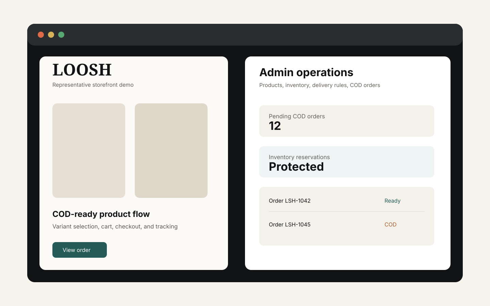

# LOOSH E-commerce Case Study

**Production e-commerce and administration system for a Lebanon-focused single-store catalog.**

> Source code is private/client-confidential. Architecture and implementation details are shared at a safe case-study level.

LOOSH is an e-commerce system built around practical storefront and owner-operator workflows: catalog browsing, product variants, cart/checkout, cash-on-delivery orders, admin operations, inventory, delivery rules, bilingual presentation, and production deployment preparation.

## Business Problem

Small commerce operators need more than a storefront. They need product operations, clear inventory handling, cash-on-delivery order management, support surfaces, delivery rules, localized currency presentation, and a deployable system that can be handed off without relying on manual developer intervention.

## Users And Roles

- **Shopper:** browses products, selects variants, uses cart/checkout, and tracks orders.
- **Admin/operator:** manages products, variants, inventory, delivery rules, exchange-rate presentation, support settings, and order status.
- **Owner:** reviews readiness, launch dependencies, deployment status, backups, and operational handoff items.

## Core Workflows

- Storefront catalog for handbags, makeup, accessories, and gift sets.
- Product variants for color/shade and selected option persistence through cart/order views.
- Cash-on-delivery checkout.
- Phone-protected order tracking by order reference.
- Admin dashboard for products, inventory edits, delivery rules, support settings, and order status updates.
- Inventory lifecycle with reservation, sold, release, and unsafe-transition controls.
- USD/LBP presentation and localized Lebanon commerce context.
- SEO metadata, sitemap, robots, JSON-LD, policy/contact/FAQ page structure.

## Architecture

The documented stack uses React, TypeScript, Vite, Tailwind, React Router, Node.js, Express, Prisma, and PostgreSQL. The public case study summarizes the architecture without publishing the private application source.

Read more:

- [Architecture](docs/architecture.md)
- [Features](docs/features.md)
- [Engineering Decisions](docs/engineering-decisions.md)
- [Quality And Delivery](docs/quality-and-delivery.md)

## Engineering Challenges

- Preserving variant choices across storefront, checkout, order confirmation, tracking, and admin views.
- Keeping inventory transitions safe around reservations, cancellations, returns, failed delivery, and delivered orders.
- Preparing production deployment with canonical URLs, CORS, sitemap generation, headers, redirects, smoke checks, and owner handoff.
- Supporting bilingual/RTL UI expectations and local currency presentation.
- Separating demo/local behavior from production behavior.

## Quality Controls

Local project documentation references linting, type checks, builds, unit tests, PostgreSQL race tests, Playwright E2E, production smoke checks, SEO checks, sitemap drift checks, dependency audit, and release-gate CI.

## Deployment Approach

LOOSH documentation covers API/runtime deployment, static storefront artifacts, domain/DNS routing, SPA fallback behavior, production smoke testing, and owner handoff requirements. Public wording avoids exposing production credentials, customer records, private docs, or sensitive deployment values.

## Contact

Need a white-label engineer for e-commerce operations, dashboards, or production stabilization? Contact [mjawadzeineddine@gmail.com](mailto:mjawadzeineddine@gmail.com).
